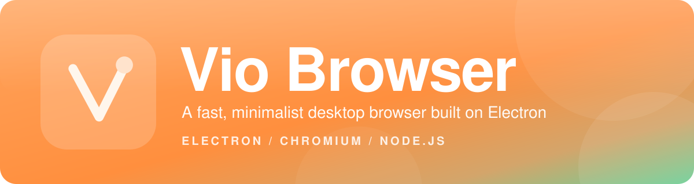
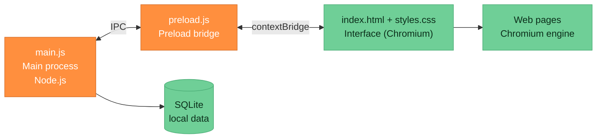

<p align="center">
  
</p>

<p align="center">
  <a href="https://github.com/Schnnitter/Vio-browser/releases"></a>
  <a href="https://github.com/Schnnitter/Vio-browser/blob/main/LICENSE"></a>
  <a href="https://www.electronjs.org/"></a>
  <a href="https://nodejs.org/"></a>
</p>

<p align="center">
  
  
  
  <a href="https://github.com/Schnnitter/Vio-browser/stargazers"></a>
  <a href="https://github.com/Schnnitter/Vio-browser/issues"></a>
</p>

<h3 align="center">
  Clean, quick and distraction-free browsing.<br>
  Built with Electron, Chromium and Node.js.
</h3>

<p align="center">
  <a href="#about">About</a> &nbsp;|&nbsp;
  <a href="#for-users">For users</a> &nbsp;|&nbsp;
  <a href="#for-developers">For developers</a> &nbsp;|&nbsp;
  <a href="#tech-stack">Tech stack</a> &nbsp;|&nbsp;
  <a href="#contributing">Contributing</a> &nbsp;|&nbsp;
  <a href="#license">License</a>
</p>


## About

**Vio** is a modern desktop web browser written with [Electron](https://www.electronjs.org/). It uses the Chromium engine to render the web and Node.js to talk to your operating system, and it wraps both in a small, clean interface that stays out of your way.

The goal is simple: a browser that opens fast, looks calm and does not bury the page you are reading under toolbars and clutter.

<table>
  <tr>
    <td width="33%" valign="top">
      <h4>Fast and light</h4>
      A minimal interface built for smooth, responsive browsing.
    </td>
    <td width="33%" valign="top">
      <h4>Full navigation control</h4>
      Tabs, back and forward history, and a proper address bar.
    </td>
    <td width="33%" valign="top">
      <h4>System</h4>
      Runs on Windows, through Electron.
    </td>
  </tr>
  <tr>
    <td width="33%" valign="top">
      <h4>Minimalist design</h4>
      No clutter, so your attention stays on the content.
    </td>
    <td width="33%" valign="top">
      <h4>Open source</h4>
      MIT licensed. Read it, fork it, change it.
    </td>
    <td width="33%" valign="top">
      <h4>Localization-ready</h4>
      The repository includes translation audit files for interface strings.
    </td>
  </tr>
</table>


## For users

### Download

Prebuilt installers will be published on the Releases page as soon as the first packaged version is ready.

<p>
  <a href="https://github.com/Schnnitter/Vio-browser/releases"></a>
</p>

Until then you can run Vio from source in a couple of minutes. You only need two free tools:

| Tool | What it is for | Download |
| --- | --- | --- |
| Node.js (LTS) | Runs and installs the app | [nodejs.org/en/download](https://nodejs.org/en/download) |
| Git | Downloads the source code | [git-scm.com/downloads](https://git-scm.com/downloads) |

### Run Vio from source

```bash
git clone https://github.com/Schnnitter/Vio-browser.git
cd Vio-browser
npm install
npm start
```

That is all. The first `npm install` downloads Electron, so it can take a little while.

You can also skip Git and download the code as a ZIP: [Download ZIP](https://github.com/Schnnitter/Vio-browser/archive/refs/heads/main.zip). Unpack it, open a terminal in the folder and run the last two commands.

### Supported systems

Vio runs wherever Electron runs: Windows, macOS and Linux. The exact list of supported versions is maintained by the Electron team, see [Electron platform support](https://www.electronjs.org/docs/latest/tutorial/support).

### Troubleshooting

**`npm install` fails while building a native module.**
Vio uses [better-sqlite3](https://github.com/WiseLibs/better-sqlite3), which is a native module. If no prebuilt binary matches your system, npm compiles it locally and needs a C++ toolchain.

| System | What to install |
| --- | --- |
| Windows | [Visual Studio Build Tools](https://visualstudio.microsoft.com/visual-cpp-build-tools/) with the C++ workload, and [Python](https://www.python.org/downloads/) |
| macOS | Xcode Command Line Tools: `xcode-select --install` |
| Linux | `build-essential` and `python3` (package names vary by distribution) |

**The window does not open.**
Run `npm start` from a terminal and read the output. Error messages there are the fastest way to find the cause, and they are exactly what we need in a bug report.

**Found a bug or have an idea?**
Open an [issue](https://github.com/Schnnitter/Vio-browser/issues/new) and describe what happened, what you expected and your operating system.


## For developers

### Prerequisites

| Requirement | Notes | Link |
| --- | --- | --- |
| Node.js | Current LTS release recommended | [nodejs.org](https://nodejs.org/) |
| npm | Ships with Node.js | [npmjs.com](https://www.npmjs.com/) |
| Git | Any recent version | [git-scm.com](https://git-scm.com/) |
| C++ toolchain | Only if a native module has to be compiled | see Troubleshooting above |
| Editor | Any editor works, Visual Studio Code is a good default | [code.visualstudio.com](https://code.visualstudio.com/) |

### Quick start

```bash
git clone https://github.com/Schnnitter/Vio-browser.git
cd Vio-browser
npm install
npm start
```

### Scripts

| Command | What it does |
| --- | --- |
| `npm start` | Launches the browser through `scripts/launch.js` |
| `npm run check` | Runs the project checks in `tools/check.js` |
| `npm run icon` | Regenerates the application icon through `tools/make-icon.js` |

### Project structure

```text
Vio-browser/
├── main.js            Electron main process: windows, app lifecycle, system access
├── preload.js         Secure bridge between the main process and the interface
├── index.html         Browser interface markup
├── styles.css         Browser interface styling
├── scripts/           Launcher and helper scripts
├── i18n-*.json        Translation audit reports for interface strings
├── package.json      Dependencies and npm scripts
└── LICENSE            MIT license
```

### How it fits together

Like every Electron app, Vio is split into processes that talk to each other through well-defined channels.



If you are new to the model, the official guides explain it well: [Process Model](https://www.electronjs.org/docs/latest/tutorial/process-model), [Context Isolation](https://www.electronjs.org/docs/latest/tutorial/context-isolation) and [Inter-Process Communication](https://www.electronjs.org/docs/latest/tutorial/ipc).

### Tech stack

<p>
  <a href="https://www.electronjs.org/"></a>
  <a href="https://www.chromium.org/"></a>
  <a href="https://nodejs.org/"></a>
  <a href="https://www.npmjs.com/"></a>
  <a href="https://developer.mozilla.org/docs/Web/JavaScript"></a>
  <a href="https://developer.mozilla.org/docs/Web/HTML"></a>
  <a href="https://developer.mozilla.org/docs/Web/CSS"></a>
  <a href="https://www.sqlite.org/"></a>
  <a href="https://git-scm.com/"></a>
</p>

Runtime dependencies from `package.json`:

| Package | What it is | Link |
| --- | --- | --- |
| `electron` | Desktop shell: Chromium plus Node.js in one runtime | [electronjs.org](https://www.electronjs.org/) |
| `better-sqlite3` | Fast synchronous SQLite driver for local storage | [GitHub](https://github.com/WiseLibs/better-sqlite3) |
| `@mozilla/readability` | The article extraction library behind Firefox Reader View | [GitHub](https://github.com/mozilla/readability) |
| `@xenova/transformers` | Run machine learning models directly in JavaScript | [GitHub](https://github.com/xenova/transformers.js) |
| `@heyputer/puter.js` | Client library for the Puter cloud platform | [GitHub](https://github.com/HeyPuter/puter) |

### Building installers

Packaging is not configured in the repository yet. When you are ready to ship installers, the two common options are:

| Tool | Best for | Link |
| --- | --- | --- |
| electron-builder | Quick setup, installers and auto-update | [electron.build](https://www.electron.build/) |
| Electron Forge | Official all-in-one toolchain from the Electron team | [electronforge.io](https://www.electronforge.io/) |

Remember that native modules such as `better-sqlite3` must be built against Electron's own Node.js version, not the one installed on your machine. Both tools above can handle this step for you.

### Useful Electron links

- [Electron documentation](https://www.electronjs.org/docs/latest)
- [Electron API reference](https://www.electronjs.org/docs/latest/api/app)
- [Security checklist](https://www.electronjs.org/docs/latest/tutorial/security)
- [Electron on GitHub](https://github.com/electron/electron)
- [Node.js documentation](https://nodejs.org/docs/latest/api/)


## Contributing

Contributions of every size are welcome, from a typo in the interface to a new feature.

1. Fork the repository.
2. Create a branch: `git checkout -b my-change`
3. Make your change and run `npm run check`.
4. Commit with a clear message and push the branch.
5. Open a pull request and describe what you changed and why.

For larger changes, please open an [issue](https://github.com/Schnnitter/Vio-browser/issues) first so we can talk about the idea before you spend time on it.

## Acknowledgements

Vio stands on the shoulders of excellent open source projects: [Electron](https://github.com/electron/electron), [Chromium](https://www.chromium.org/), [Node.js](https://nodejs.org/), [Readability](https://github.com/mozilla/readability), [Transformers.js](https://github.com/xenova/transformers.js), [better-sqlite3](https://github.com/WiseLibs/better-sqlite3) and [Puter](https://github.com/HeyPuter/puter). Thank you to everyone who builds and maintains them.

## License

Vio Browser is released under the [MIT License](LICENSE).


<p align="center">
  <br>
  <sub>Made by <a href="https://github.com/Schnnitter">Schnnitter</a></sub>
</p>
